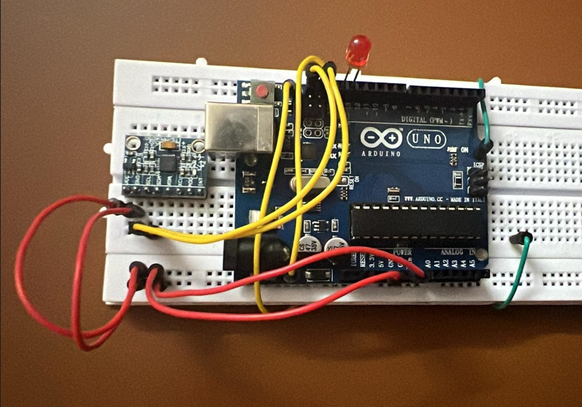

# 🔥🔥🔥 FPS-for-all 🔥🔥🔥
## FPS for all: Người Khuyết Tật Cũng Xứng Đáng Với Aim Assistant Hàng Đầu Từ Arduino 🔥🔥🔥
🫵 Bạn muốn chinh phục game FPS, tuy nhiên đối thủ quá mạnh?

🫵 Bạn bè bạn bắn quá hay, và bạn đã quá chán với điều này?

🫵 Bạn muốn chơi game, nhưng bạn không có tay (phải)?

Bỏ chuột xuống đi, chúng ta có Aim Assistant rồi! - FPS bình đẳng cho tất cả, ngay cả khi bạn không có tay phải! 😱

💥 Đừng lo! Giải pháp của chúng tôi giúp bạn chơi game với hiệu suất đỉnh cao, dù bạn có gặp bất kỳ trở ngại nào!

🔥 Aim Assistant tích hợp AI thông minh: tự động khóa mục tiêu với độ chính xác tuyệt đối, biến bạn thành tay thiện xạ chỉ trong tích tắc!

🕹️ Cảm biến chuyển động tiên tiến: Điều khiển dễ dàng chỉ với một vài cử động đầu, giúp bạn giữ sự thoải mái trong suốt trận chiến.

🚀 Trải nghiệm FPS mượt mà: Không còn lo ngại về kỹ năng hoặc khả năng vật lý – mọi người đều có thể chơi và giành chiến thắng!

⚠️ Lưu ý: Ứng dụng tạo ra với mục đích học tập, không phải để hack cheat game.

## Environment requirement
1. Install requirements:
   ```bash
   pip install -r requirements.txt
2. Install pytorch: https://pytorch.org/

## Train Model
### Train File Structure
```
Train
├── train
│ ├── images
│ └── labels
├── valid
│ ├── images
│ └── labels
├── data.yaml
├── train.py
└── yolo11n.pt
```
### Train
Run train.py
## Setup
### Yêu cầu
Dự án gồm yêu cầu khá nhiều về phần cứng. Bạn cần chuẩn bị:
 - 1 laptop cấu hình ổn (Nvidia 4050)
 - Arduino Uno R3
 - Cảm biến MPU6050
 - Dây cắm đực-đực
 - Breadboard
### Cài đặt
 - Về Arduino, bạn lắp như sau:
<table style="padding:10px">
  <tr>
    <td width="100%"></td>
  </tr>
</table>

 - Bạn cũng có thể tham khảo link sau: [link](https://arduinokit.vn/huong-dan-su-dung-cam-bien-gia-toc-mpu6050-voi-arduino/).
 - Sau khi lắp đặt, bạn cần tải ArduinoIDE, mở file MPU6050.ino, cài các thư viện được sử dụng, compile và truyền data vào mạch
 - Bạn cần hiệu chỉnh các giá trị của cảm biến bằng cách sử dụng SerialMonitor. (Hiệu chỉnh các tham số của Kalman filter và công thức tính vx, vy).

## Run!
Chúng ta có 2 file là aimbot.py và arduino.py. Mỗi file có 1 tác dụng riêng. Về cơ bản, bạn chỉ cần bật file aimbot.py và chạy. File Arduino sẽ được sử dụng khi bạn dùng arduino điều khiển chuột.
 - aimbot.py là aimbot.
 - arduino.py là file để chạy cảm biến bằng arduino giúp điều khiển chuột.

## Gameplay
Preview of Object Detection: [link](https://www.youtube.com/watch?v=q1EYzm-0Jjo)

Preview of Aim Assistant: [link](https://www.youtube.com/watch?v=AWstyUH8ScE)
