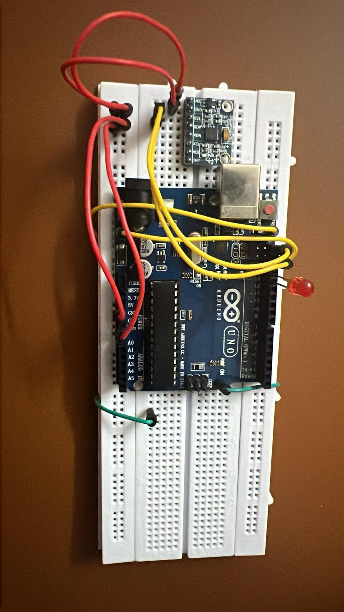

# FPS-for-all
## FPS for all: Người Khuyết Tật Cũng Xứng Đáng Với Aim Bot Hàng Đầu Từ Arduino

Bỏ chuột xuống đi, chúng ta có Aim Bot rồi! - FPS bình đẳng cho tất cả, ngay cả khi bạn không có tay phải!

## Setup
### Yêu cầu
Dự án gồm yêu cầu khá nhiều về phần cứng. Bạn cần chuẩn bị:
 - 1 laptop cấu hình ổn (Nvidia 4050)
 - Arduino Uno R3
 - Cảm biến MPU6050
 - Dây cắm đực-đực
 - Breadboard
### Cài đặt
 - Về Arduino, bạn lắp như sau:
<table style="padding:10px">
  <tr>
    <td width="100%"></td>
  </tr>
</table>
 - Bạn cũng có thể tham khảo link sau: [link](https://arduinokit.vn/huong-dan-su-dung-cam-bien-gia-toc-mpu6050-voi-arduino/).
 - Sau khi lắp đặt, bạn cần tải ArduinoIDE, mở file MPU6050.ino, cài các thư viện được sử dụng, compile và truyền data vào mạch
 - Bạn cần hiệu chỉnh các giá trị của cảm biến bằng cách sử dụng SerialMonitor. (Hiệu chỉnh các tham số của Kalman filter và công thức tính vx, vy).

## Run!
Chúng ta có 2 file là aimbot.py và arduino.py. Mỗi file có 1 tác dụng riêng.
 - aimbot.py là aimbot.
 - arduino.py là file để chạy chuột