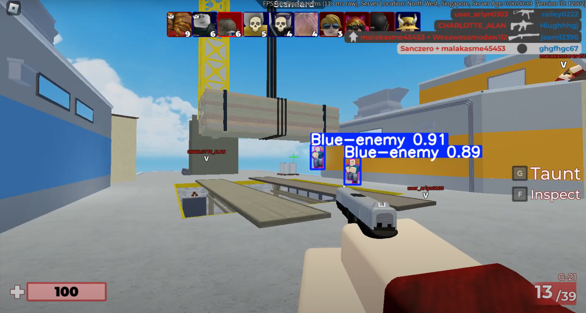
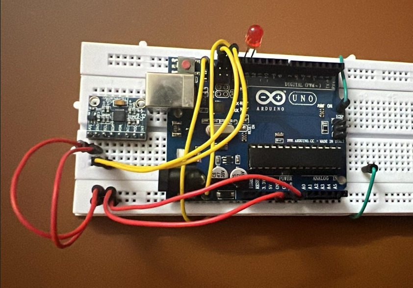

# 🔥🔥🔥 FPS-for-all 🔥🔥🔥
## FPS for All: Assistive Aim Assistant for People with Disabilities using Arduino 🔥🔥🔥
🫵 Do you want to play FPS games but feel outmatched by stronger opponents?

🫵 Are your friends much better at aiming, and you're tired of falling behind?

🫵 Do you want to play, but have limited use of your right hand?

Put the mouse down — we’ve got an Aim Assistant! Equal FPS experience for everyone, even without a right hand! 😱

💥 Don’t worry! Our system helps you achieve high performance regardless of physical limitations.

🔥 AI-powered Aim Assistant: Automatically detects and aligns targets with high accuracy using computer vision.

🕹️ Motion-based Control: Control the cursor using simple head movements with motion sensors, ensuring comfort during gameplay.

🚀 Smooth FPS Experience: No need to worry about skill gaps or physical constraints — everyone can play and compete!

⚠️ Note: This project is developed for educational purposes only. It is not intended for cheating or unfair gameplay.

### Preview image:
   

   
## Environment requirement
1. Install requirements:
   ```bash
   pip install -r requirements.txt
2. Install pytorch: https://pytorch.org/

## Train Model
### Train File Structure
```
Train
├── train
│ ├── images
│ └── labels
├── valid
│ ├── images
│ └── labels
├── data.yaml
├── train.py
└── yolo11n.pt
```
### Train
Run train.py
## Setup
### Hardware Requirements
This project requires several hardware components:

A laptop with a decent GPU (e.g., Nvidia RTX 4050)
Arduino Uno R3
MPU6050 sensor (gyroscope + accelerometer)
Male-to-male jumper wires
Breadboard

### Installation
 - Connect the Arduino and MPU6050 as shown below:
<table style="padding:10px">
  <tr>
    <td width="100%"></td>
  </tr>
</table>

 - After wiring: Install Arduino IDE, open MPU6050.ino, install required libraries, compile and upload to the board
 - Calibrate the sensor using Serial Monitor.

## Run!
There are two main files. aimbot.py to handles object detection and aim assistance, arduino.py to reads sensor data and controls mouse movement with your head

## Gameplay
Preview of Object Detection: [link](https://www.youtube.com/watch?v=q1EYzm-0Jjo)

Preview of Aim Assistant: [link](https://www.youtube.com/watch?v=AWstyUH8ScE)

Preview project: [link](https://www.youtube.com/watch?v=n9dhpIuCFz8)
